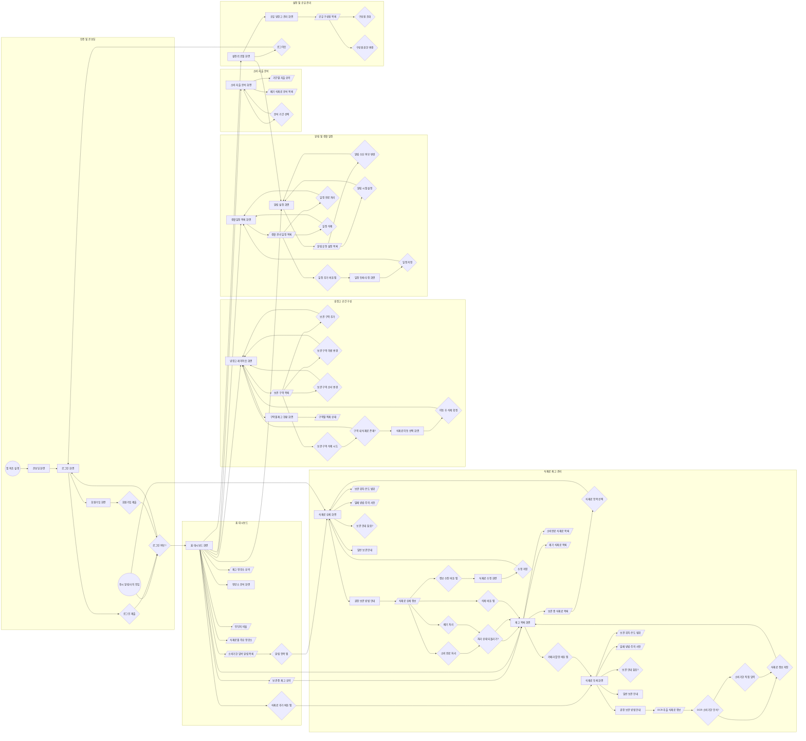

```mermaid
flowchart LR

  subgraph s1 ["인증 및 온보딩"]
    n1(("앱 최초 실행"))
    n2(("푸시 알림 터치 진입"))
    n3["온보딩 화면"]
    n4["로그인 화면"]
    n5{"로그인 제출"}
    n6["회원가입 화면"]
    n7{"회원가입 제출"}
    n8{"로그인 여부?"}
  end

  subgraph s2 ["홈 대시보드"]
    n9["홈 대시보드 화면"]
    n10[/"소비기한 임박 알림 목록"/]
    n11[/"보관 중 재고 요약"/]
    n12{"식재료 추가 버튼 탭"}
    n13{"알림 항목 탭"}
    c02f112e_90d2_40a6_aa2a_d060509a9a56[/"재고 영양소 요약"/]
    c51ee083_b566_4c33_ae9d_80fa0658a943["영양소 분석 화면"]
    d2955813_2107_4933_aa9a_4dff90ce700a[/"탄단지 비율"/]
    48ce91fe_b70e_4c4e_88d6_afcddba8155e[/"식재료별 주요 영양소"/]
  end

  subgraph s3 ["식재료 재고 관리"]
    n14["재고 목록 화면"]
    n15[/"보관 중 식재료 목록"/]
    n16[/"소비완료 식재료 목록"/]
    n17[/"폐기 식재료 목록"/]
    n18{"식재료 항목 선택"}
    n19{"카메라 촬영 버튼 탭"}
    n20["식재료 등록 화면"]
    n21[/"OCR 추출 식재료 정보"/]
    n22{"OCR 소비기한 인식?"}
    n23{"소비기한 직접 입력"}
    n24{"식재료 정보 저장"}
    n25["식재료 상세 화면"]
    n26[/"식재료 상세 정보"/]
    n27{"소비 완료 처리"}
    n28{"폐기 처리"}
    n29{"정보 수정 버튼 탭"}
    n30{"삭제 버튼 탭"}
    n31["식재료 수정 화면"]
    n32{"수정 저장"}
    n33{"처리 상태 되돌리기?"}
    e61239ed_4cb2_4e49_a090_ca5189d8eaa3["권장 보관 방법 안내"]
    12838a08_32f3_4264_ad67_b76d2716f432[/"보관 위치·온도 범위"/]
    897c75d1_b62e_4354_bd6d_b30b224a0b67[/"밀폐 방법·주의 사항"/]
    d693b070_a163_45ce_b0ee_5468906a3f4f{"보관 안내 찾음?"}
    94c3bc95_3149_4413_9b03_7f13493cedfe["일반 보관 안내"]
    d8cba343_9451_47a3_ad5d_ec8a6fc3c9ff["권장 보관 방법 안내"]
    1fd47ccf_7576_4905_b756_3d4deb55fe86[/"보관 위치·온도 범위"/]
    bc964246_7d89_4e26_9b17_2b1de695398c[/"밀폐 방법·주의 사항"/]
    36ed2e5d_c86d_4fc8_b9ef_69786a7d70e4{"보관 안내 찾음?"}
    a6ba7782_c0e9_4c20_a193_d2179713491b["일반 보관 안내"]
  end

  subgraph s4 ["냉장고 공간 구성"]
    n34["냉장고 레이아웃 화면"]
    n35[/"보관 구역 목록"/]
    n36{"보관 구역 추가"}
    n37{"보관 구역 이름 변경"}
    n38{"보관 구역 순서 변경"}
    n39{"보관 구역 삭제 시도"}
    n40{"구역 내 식재료 존재?"}
    n41["식재료 이동 선택 화면"]
    n42{"이동 후 삭제 확정"}
    n43["구역별 재고 현황 화면"]
    n44[/"구역별 적재 상태"/]
  end

  subgraph s5 ["알림 및 생활 일정"]
    n45["알림 설정 화면"]
    n46[/"알림 유형 설정 목록"/]
    n47{"알림 수신 여부 변경"}
    n48{"알림 시점 설정"}
    n49["생활일정 목록 화면"]
    n50[/"생활 관리 일정 목록"/]
    n51{"일정 추가 버튼 탭"}
    n52["일정 등록/수정 화면"]
    n53{"일정 저장"}
    n54{"일정 완료 처리"}
    n55{"일정 삭제"}
  end

  subgraph s6 ["소비·지출 분석"]
    n56["소비·지출 분석 화면"]
    n57[/"기간별 지출 요약"/]
    n58[/"폐기 식재료 분석 목록"/]
    n59{"분석 기간 선택"}
  end

  subgraph s7 ["설정 및 공유 관리"]
    n60["설정/프로필 화면"]
    n61["공유 냉장고 관리 화면"]
    n62[/"공유 구성원 목록"/]
    n63{"구성원 초대"}
    n64{"구성원 권한 변경"}
    n65{"로그아웃"}
  end

  n1 --> n3
  n3 --> n4
  n2 --> n8
  n4 --> n5
  n5 --> n8
  n4 --> n6
  n6 --> n7
  n7 --> n8
  n8 --> n9
  n8 --> n4
  n9 --> n10
  n9 --> n11
  n10 --> n13
  n13 --> n25
  n11 --> n14
  n9 --> n12
  n12 --> n20
  n9 --> n14
  n14 --> n15
  n14 --> n16
  n14 --> n17
  n15 --> n18
  n18 --> n25
  n14 --> n19
  n19 --> n20
  n21 --> n22
  n22 --> n24
  n22 --> n23
  n23 --> n24
  n24 --> n14
  n26 --> n27
  n26 --> n28
  n27 --> n33
  n28 --> n33
  n33 --> n14
  n33 --> n14
  n26 --> n29
  n29 --> n31
  n31 --> n32
  n32 --> n25
  n26 --> n30
  n30 --> n14
  n9 --> n34
  n34 --> n35
  n35 --> n36
  n35 --> n37
  n35 --> n38
  n35 --> n39
  n39 --> n40
  n40 --> n41
  n40 --> n34
  n41 --> n42
  n42 --> n34
  n36 --> n34
  n37 --> n34
  n38 --> n34
  n34 --> n43
  n43 --> n44
  n9 --> n49
  n49 --> n50
  n50 --> n51
  n51 --> n52
  n52 --> n53
  n53 --> n49
  n50 --> n54
  n54 --> n49
  n50 --> n55
  n55 --> n49
  n9 --> n45
  n45 --> n46
  n46 --> n47
  n46 --> n48
  n47 --> n45
  n48 --> n45
  n9 --> n56
  n56 --> n57
  n56 --> n58
  n56 --> n59
  n59 --> n56
  n9 --> n60
  n60 --> n61
  n61 --> n62
  n62 --> n63
  n62 --> n64
  n60 --> n65
  n65 --> n4
  n60 --> n45
  n2 --> n25
  n9 --> c02f112e_90d2_40a6_aa2a_d060509a9a56
  n9 --> c51ee083_b566_4c33_ae9d_80fa0658a943
  n9 --> d2955813_2107_4933_aa9a_4dff90ce700a
  n9 --> 48ce91fe_b70e_4c4e_88d6_afcddba8155e
  n20 --> e61239ed_4cb2_4e49_a090_ca5189d8eaa3
  e61239ed_4cb2_4e49_a090_ca5189d8eaa3 --> n21
  n20 --> 12838a08_32f3_4264_ad67_b76d2716f432
  n20 --> 897c75d1_b62e_4354_bd6d_b30b224a0b67
  n20 --> d693b070_a163_45ce_b0ee_5468906a3f4f
  n20 --> 94c3bc95_3149_4413_9b03_7f13493cedfe
  n25 --> d8cba343_9451_47a3_ad5d_ec8a6fc3c9ff
  d8cba343_9451_47a3_ad5d_ec8a6fc3c9ff --> n26
  n25 --> 1fd47ccf_7576_4905_b756_3d4deb55fe86
  n25 --> bc964246_7d89_4e26_9b17_2b1de695398c
  n25 --> 36ed2e5d_c86d_4fc8_b9ef_69786a7d70e4
  n25 --> a6ba7782_c0e9_4c20_a193_d2179713491b
```
